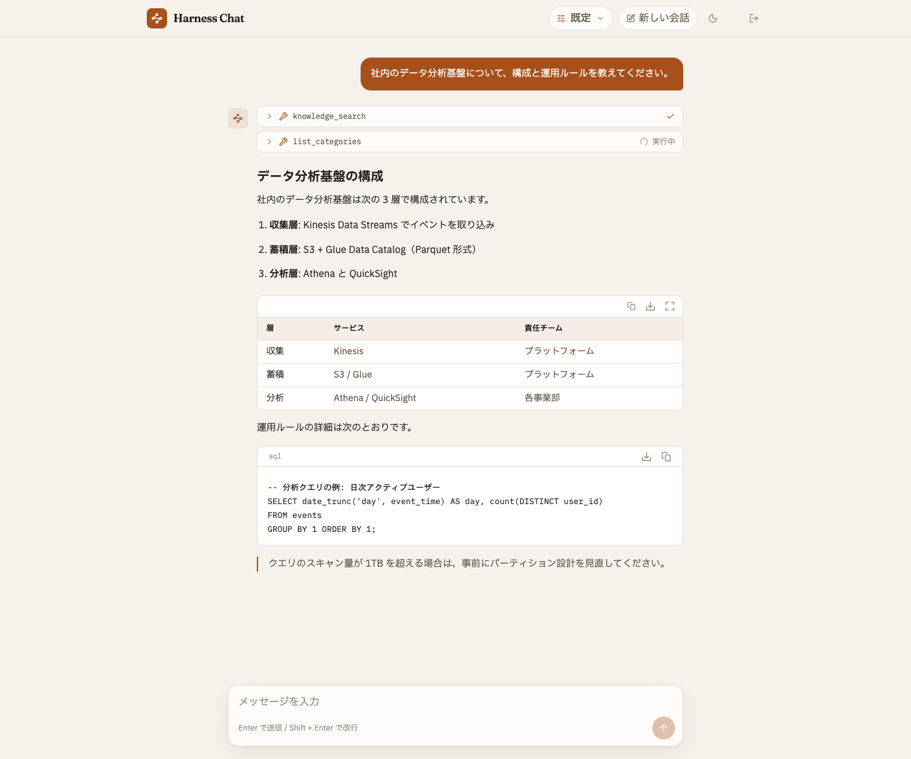
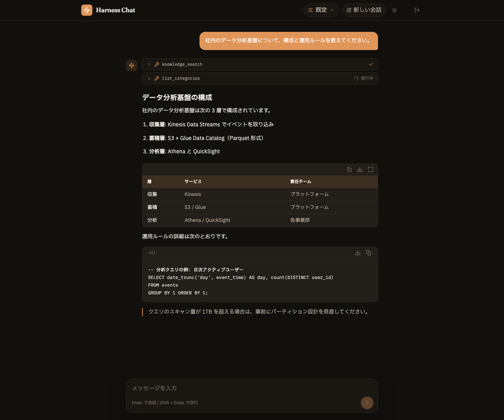
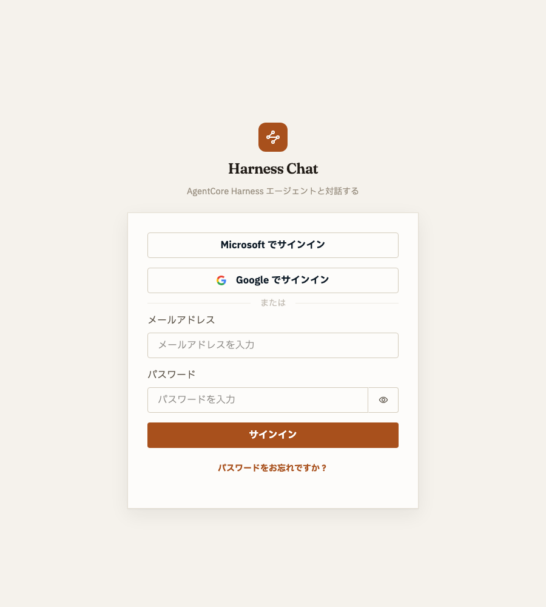
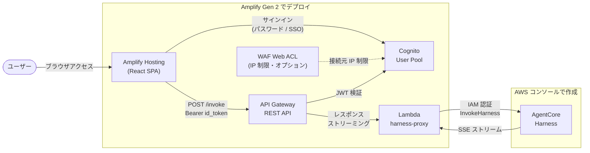

# AgentCore Harness Chat

[English](README.md) | 日本語

Amazon Bedrock AgentCore Harness を社内・チーム向けに安全に公開するためのチャット Web アプリテンプレートです。Amplify Gen 2 ベースで、Harness 単体では実現しにくい非機能要件（SSO・IP 制限・サインアップ制御）をかぶせて配布できます。



<details>
<summary>ダークテーマ / ログイン画面</summary>




</details>

## いつ使うか

AgentCore Harness を使うと、コンソール上で model / system prompt / tools を設定するだけでエージェントを作れます。ただし、そのエージェントを**使う側にも AWS マネジメントコンソールへのサインインが必要**です。「コンソールで試したエージェントが良かったので、そのままチームに配りたい」となったとき、利用者全員に IAM ユーザーやコンソールアクセスを払い出すのは避けたいところです。

このテンプレートは Harness の前段に Cognito 認証付きの Web チャットを置くことで、この問題を解決します。

- コンソールで作った Harness エージェントを、**AWS アカウントを持たないメンバー**にブラウザだけで使ってもらえる
- 利用者ごとの IAM ユーザー払い出しが不要（AWS への権限は Lambda の IAM ロール 1 つに集約され、利用者は Cognito のユーザーとして管理）
- 社内配布の前提になる非機能をまとめて用意（Google / Entra ID の SSO、WAF による IP 制限、サインアップ制御）
- エージェントの改善はコンソールでの設定変更だけ。アプリの再デプロイなしで利用者に即反映

## できること

- AgentCore Harness とのストリーミングチャット（ツール使用の可視化・モデル切替）
- Cognito 認証（メール + パスワード / Google / Microsoft Entra ID フェデレーション）
- SSO 専用モード（パスワードログインの無効化）
- WAF による IP 制限（Cognito ログインの保護）
- セルフサインアップ制御（メールドメイン制限・管理者ユーザーの自動作成）

エージェント本体（model / system prompt / tools）は AWS コンソールの Harness 設定画面で管理します。エージェントの振る舞いを変えるためにこのテンプレートを再デプロイする必要はありません。

## アーキテクチャ



| リソース | 役割 |
|---|---|
| Cognito User Pool | ユーザー認証（SSO フェデレーション・サインアップ制御を含む） |
| API Gateway REST | `POST /invoke`。Cognito Authorizer で JWT 検証、レスポンスストリーミング対応 |
| Lambda harness-proxy | Harness を IAM 認証で呼び出し、SSE をそのまま透過するプロキシ |
| WAF Web ACL（オプション） | Cognito への接続元 IP 制限 |

Harness 本体は AWS コンソールで作成し、ARN を環境変数で渡します。Harness の呼び出しは Lambda の IAM ロール（`bedrock-agentcore:InvokeHarness`）で認証するため、**Harness 側に JWT Authorizer の設定は不要**です。会話のセッションは Harness が管理します。

## ディレクトリ構成

```
├── amplify/                      # Amplify Gen 2 バックエンド定義
│   ├── backend.ts                # API Gateway + Lambda + WAF などの CDK 配線
│   ├── parameters.ts             # デプロイパラメータ（環境変数で制御）
│   ├── auth/resource.ts          # Cognito（defineAuth・SSO・サインアップトリガー）
│   └── functions/
│       ├── harness-proxy/        # ストリーミングプロキシ Lambda（Node.js 22）
│       └── pre-sign-up/          # メールドメイン制限トリガー
├── src/                          # React フロントエンド
│   ├── components/               # AuthGate, ChatMessage, ChatInput, ModelSelector など
│   ├── hooks/                    # useChat, useTheme
│   ├── lib/                      # Harness クライアント・SSE パーサ・モデル定義
│   └── dev/                      # デザインプレビュー用モックデータ
└── docs/                         # セットアップ手順書
```

## 事前準備

- Node.js 24 以上
- AWS CLI（認証情報設定済み）
- AgentCore Harness が利用できるリージョン（例: `us-east-1`）

## セットアップ

### 1. Harness を作成する

AWS コンソールで Harness を作成し、ARN を取得します。手順は [docs/Harnessのセットアップ.md](docs/Harnessのセットアップ.md) を参照してください。

### 2. デプロイする

```bash
npm install

HARNESS_ARN=arn:aws:bedrock-agentcore:us-east-1:123456789012:harness/xxxxxxxx \
ADMIN_USER_EMAIL=you@example.com \
  npx ampx sandbox --once
```

- `HARNESS_ARN` は必須です。未設定の場合、synth 時にエラーになります
- セルフサインアップはデフォルト無効のため、`ADMIN_USER_EMAIL` を設定すると最初のユーザーが作成され、仮パスワードがメールで届きます

デプロイが完了すると `amplify_outputs.json` が生成され、フロントエンドは API URL や Cognito 設定をこのファイルから自動的に読み取ります。

### 3. 開発サーバーを起動する

```bash
npm run dev
```

`http://localhost:5173` を開き、仮パスワードでログイン（初回にパスワード変更）するとチャットを試せます。

## 本番デプロイ（Amplify Hosting）

sandbox とは別に、Git 連携による本番環境を作る手順です。リージョンは Harness に合わせます（例: `us-east-1`）。

### 1. リポジトリを用意する

このリポジトリを fork するか、自分の GitHub リポジトリへ push します。

### 2. Amplify アプリを作成する

1. [Amplify コンソール](https://console.aws.amazon.com/amplify/)で「新しいアプリを作成」→「GitHub」を選択します
2. GitHub の認可画面で、対象リポジトリへのアクセスを許可します
3. リポジトリとブランチ（例: `main`）を選択します。Amplify Gen 2 プロジェクトとして自動検出され、ビルド設定は自動生成されます
4. バックエンドのデプロイに使う**サービスロール**の作成を求められたら、案内に従って作成します

### 3. 環境変数を設定する（初回デプロイ前に）

アプリ設定 →「環境変数」に設定します。**`HARNESS_ARN` を設定しないままビルドすると synth エラーで失敗する**ので、初回デプロイの開始前に設定してください。

| キー | 必須 | 値 |
|---|---|---|
| `HARNESS_ARN` | ✅ | Harness の ARN |
| `ADMIN_USER_EMAIL` | 推奨 | 最初のログインユーザー（仮パスワードがメールで届く） |
| その他 | 任意 | [オプション機能](#オプション機能)の各環境変数 |

SSO を使う場合は、アプリ設定 →「シークレット」に `GOOGLE_CLIENT_ID` / `GOOGLE_CLIENT_SECRET`（Entra ID なら `ENTRA_CLIENT_ID` / `ENTRA_CLIENT_SECRET`）も設定します。

> sandbox の `ampx sandbox secret set` とは別管理です。本番用にここで改めて設定してください。

### 4. 初回デプロイ → APP_ORIGINS を反映する

アプリの URL は初回デプロイ後に発行されるため、2 段階になります。

1. 初回デプロイの完了後、発行された URL（`https://main.xxxxxxxx.amplifyapp.com`）を確認します
2. 環境変数 `APP_ORIGINS` にその URL を設定し、**再デプロイ**します（最新ビルドの「このバージョンを再デプロイ」で OK）

これで CORS 許可と Cognito のコールバック URL に本番 URL が反映されます。**この手順を飛ばすと、画面は開けてもチャット送信が CORS エラーになります。**

### 5. SSO のリダイレクト URI を登録する（SSO を使う場合のみ）

本番は sandbox とは**別の Cognito User Pool・別ドメイン**が作られます。Cognito コンソールで本番 User Pool のドメイン（`xxxxxxxx.auth.<region>.amazoncognito.com`）を確認し、Google / Entra ID 側に `https://<本番ドメイン>/oauth2/idpresponse` を**追加**登録してください。sandbox 用に登録した URI は残したままで共存できます。

### 6. 動作確認

発行された URL を開き、`ADMIN_USER_EMAIL` に届いた仮パスワードでログイン（初回にパスワード変更）してチャットを送信します。以後、`main` ブランチへの push で自動的に再デプロイされます（フルスタックビルドのため 10 分前後かかります）。

## オプション機能

すべて環境変数で制御します。パラメータの一覧と説明は [amplify/parameters.ts](amplify/parameters.ts) を参照してください。

自分の環境専用にデプロイする場合は、環境変数の代わりに `amplify/parameters.ts` の値を直接書き換えても構いません（例: `selfSignUp: true`）。環境変数の設定漏れがなくなり、設定がコードとして残ります。ただし Harness の ARN やテナント ID などアカウント固有の情報を書いた場合は、そのままパブリックリポジトリへコミットしないよう注意してください。

| 機能 | 環境変数 | 備考 |
|------|---------|------|
| 管理ユーザー作成 | `ADMIN_USER_EMAIL=admin@example.com` | デプロイ時にユーザーを作成し、仮パスワードをメール送付。セルフサインアップ無効時の初回ログイン手段 |
| セルフサインアップ | `SELF_SIGNUP=true` | デフォルトは無効（管理者によるユーザー作成のみ） |
| メールドメイン制限 | `ALLOWED_EMAIL_DOMAINS=example.com,example.co.jp` | セルフサインアップと SSO の初回サインインの両方に適用 |
| Google SSO | `GOOGLE_AUTH=true` | 手順: [docs/Google_SSOの設定.md](docs/Google_SSOの設定.md) |
| Entra ID SSO | `ENTRA_AUTH=true` `ENTRA_TENANT_ID=<tenant-id>` | 手順: [docs/EntraID_SSOの設定.md](docs/EntraID_SSOの設定.md) |
| SSO 専用モード | `SSO_ONLY=true` | パスワードログインを無効化。`GOOGLE_AUTH` または `ENTRA_AUTH` が必要 |
| WAF IP 制限 | `ALLOWED_IPV4_CIDRS=203.0.113.0/24` | 手順: [docs/WAFによるIP制限.md](docs/WAFによるIP制限.md)。未指定なら WAF を作成しない |
| CORS 許可オリジン | `APP_ORIGINS=http://localhost:5173,https://example.com` | デフォルトは `http://localhost:5173` |

> **Google SSO を使う場合の注意**: Cognito のフェデレーションは初回サインイン時にユーザーを自動作成するため、既定では**任意の Google アカウント**でサインインできます。組織内に限定するには `ALLOWED_EMAIL_DOMAINS` を併せて設定してください（Entra ID はシングルテナント構成のため、自テナントのメンバーに限定されます）。

## モデルセレクタの仕組み

ヘッダーのモデルセレクタで選んだモデルは、リクエストの `modelId` として Lambda プロキシに渡り、Harness のデフォルトモデルを会話単位で上書きします。「エージェント既定」を選ぶと `modelId` を送らず、Harness に設定されたモデルが使われます。クロスリージョン推論のプレフィックス（`us.` / `jp.`）は Lambda が自動付与するため、フロントエンドはリージョンを意識しません。選択は localStorage に保存されます。

## コスト概算

主要コストは Bedrock のモデル推論（トークン従量）と AgentCore の従量課金で、利用量に比例します。テンプレートが作るインフラ自体はほぼ従量課金で、小規模利用なら数ドル/月程度です。

| リソース | 目安 |
|---|---|
| Bedrock モデル推論 / AgentCore Harness | 利用量に比例（支配的なコスト）。[Bedrock の料金](https://aws.amazon.com/bedrock/pricing/)を参照 |
| Cognito | 無料枠 10,000 MAU（Essentials ティア） |
| API Gateway REST | $3.50/100 万リクエスト |
| Lambda | ストリーミング中は実行時間課金が続く（応答 1 分 × ARM 128MB ≒ $0.0001/回） |
| Amplify Hosting | ビルド $0.01/分、配信 $0.15/GB |
| WAF（有効時のみ） | 約 $6〜7/月の固定費 |

## トラブルシューティング

### `HARNESS_ARN が設定されていません` で synth が失敗する

環境変数 `HARNESS_ARN` を設定して再実行してください。Harness の作成手順は [docs/Harnessのセットアップ.md](docs/Harnessのセットアップ.md) を参照してください。

### ブラウザで CORS エラーになる

ブラウザで開いているオリジンと `APP_ORIGINS` が**ポート番号まで完全一致**している必要があります。開発サーバーは `5173` に固定しています（使用中の場合は起動エラーになるので、占有しているプロセスを止めてください）。本番 URL を追加した場合は再デプロイが必要です。

### `Failed to retrieve backend secret` でデプロイが失敗する

SSO フラグを有効にしたのに secret が未設定です。`npx ampx sandbox secret set GOOGLE_CLIENT_ID` などで設定してください（[docs/Google_SSOの設定.md](docs/Google_SSOの設定.md) / [docs/EntraID_SSOの設定.md](docs/EntraID_SSOの設定.md)）。

### モデルエラー（`on-demand throughput isn't supported`）

Lambda プロキシがモデル ID にリージョンプレフィックスを自動付与しますが、選択肢にないカスタムモデル ID を使う場合は完全修飾 ID（例: `us.anthropic.claude-sonnet-4-5-20250929-v1:0`）を指定してください。

### チャットが応答しない

1. AWS コンソールで Harness のステータスが ACTIVE であることを確認します
2. ブラウザの開発者ツール → Network タブで `/invoke` のレスポンスを確認します（401 ならトークン期限切れの可能性。再ログインしてください）
3. CloudWatch Logs で harness-proxy Lambda のログを確認します

### SSO でログインできない

[docs/Google_SSOの設定.md](docs/Google_SSOの設定.md) / [docs/EntraID_SSOの設定.md](docs/EntraID_SSOの設定.md) 末尾のトラブルシューティングを参照してください。Entra ID は ID トークンの email クレーム設定が漏れがちです。

## デザインプレビュー（バックエンド不要）

開発サーバー起動後、`http://localhost:5173/?preview` を開くと認証・バックエンドなしでモック会話を使った UI 確認ができます（`?preview&theme=dark` でダークテーマ）。開発ビルド限定の機能です。

## ライセンス

[MIT](LICENSE)
