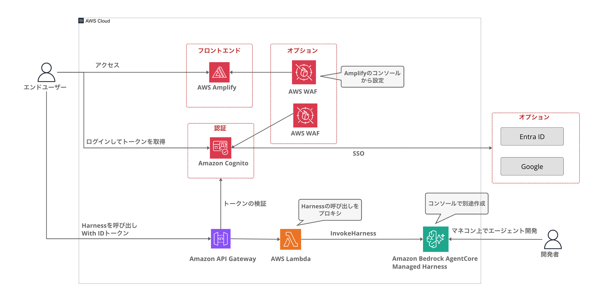

# AgentCore Harness Chat

English | [日本語](README.ja.md)

A chat web app template for safely sharing Amazon Bedrock AgentCore Harness agents with your team or organization. Built on Amplify Gen 2, it layers the non-functional requirements that Harness alone does not cover (SSO, IP restriction, sign-up control) on top of your agent.


<details>
<summary>Dark theme / Login screen</summary>


</details>

## When to use this

With AgentCore Harness, you can build an agent just by configuring model / system prompt / tools in the console. However, **users of that agent also need to sign in to the AWS Management Console**. When you think "this agent I tried in the console is great — let's share it with the team", you probably don't want to issue IAM users or console access to every single user.

This template solves that by placing a Cognito-authenticated web chat in front of the Harness.

- Members **without an AWS account** can use your console-built Harness agent from just a browser
- No per-user IAM users required (AWS permissions are consolidated into a single Lambda IAM role; users are managed as Cognito users)
- Non-functional requirements for internal distribution are included out of the box (Google / Entra ID SSO, WAF IP restriction, sign-up control)
- Improving the agent only requires configuration changes in the console — changes reach users immediately, with no app redeploy

## Features

- Streaming chat with AgentCore Harness (tool-use visualization, model switching)
- Cognito authentication (email + password / Google / Microsoft Entra ID federation)
- SSO-only mode (disables password login)
- IP restriction via WAF (protects Cognito login)
- Self sign-up control (email domain restriction, automatic admin user creation)

The agent itself (model / system prompt / tools) is managed in the Harness settings screen of the AWS console. You never need to redeploy this template to change the agent's behavior.

## Architecture



| Resource | Role |
|---|---|
| Cognito User Pool | User authentication (including SSO federation and sign-up control) |
| API Gateway REST | `POST /invoke`. JWT verification with Cognito Authorizer, response streaming |
| Lambda harness-proxy | Invokes the Harness with IAM auth and passes the SSE stream through |
| WAF Web ACL (optional) | Source IP restriction for Cognito |

The Harness itself is created in the AWS console, and its ARN is passed via an environment variable. Harness invocation is authenticated by the Lambda IAM role (`bedrock-agentcore:InvokeHarness`), so **no JWT Authorizer configuration is needed on the Harness side**. Conversation sessions are managed by the Harness.

## Directory structure

```
├── amplify/                      # Amplify Gen 2 backend definition
│   ├── backend.ts                # CDK wiring for API Gateway + Lambda + WAF, etc.
│   ├── parameters.ts             # Deploy parameters (controlled via environment variables)
│   ├── auth/resource.ts          # Cognito (defineAuth, SSO, sign-up trigger)
│   └── functions/
│       ├── harness-proxy/        # Streaming proxy Lambda (Node.js 22)
│       └── pre-sign-up/          # Email domain restriction trigger
├── src/                          # React frontend
│   ├── components/               # AuthGate, ChatMessage, ChatInput, ModelSelector, etc.
│   ├── hooks/                    # useChat, useTheme
│   ├── lib/                      # Harness client, SSE parser, model definitions
│   └── dev/                      # Mock data for design preview
└── docs/                         # Setup guides (Japanese)
```

## Prerequisites

- Node.js 24 or later
- AWS CLI (with credentials configured)
- A region where AgentCore Harness is available (e.g. `us-east-1`)

## Setup

### 1. Create a Harness

Create a Harness in the AWS console and note its ARN. See [docs/Harnessのセットアップ.md](docs/Harnessのセットアップ.md) (Japanese) for the steps.

### 2. Deploy

```bash
npm install

HARNESS_ARN=arn:aws:bedrock-agentcore:us-east-1:123456789012:harness/xxxxxxxx \
ADMIN_USER_EMAIL=you@example.com \
  npx ampx sandbox --once
```

- `HARNESS_ARN` is required. If unset, synth fails with an error
- Self sign-up is disabled by default, so setting `ADMIN_USER_EMAIL` creates the first user and sends a temporary password by email

Once the deploy completes, `amplify_outputs.json` is generated, and the frontend automatically reads the API URL and Cognito settings from it.

### 3. Start the dev server

```bash
npm run dev
```

Open `http://localhost:5173`, log in with the temporary password (you will change it on first login), and try the chat.

## Production deploy (Amplify Hosting)

Separately from the sandbox, these are the steps to create a Git-connected production environment. Match the region to your Harness (e.g. `us-east-1`).

### 1. Prepare a repository

Fork this repository, or push it to your own GitHub repository.

### 2. Create an Amplify app

1. In the [Amplify console](https://console.aws.amazon.com/amplify/), choose "Create new app" → "GitHub"
2. On the GitHub authorization screen, grant access to the target repository
3. Select the repository and branch (e.g. `main`). It is auto-detected as an Amplify Gen 2 project and the build settings are generated automatically
4. If prompted to create a **service role** for the backend deploy, follow the instructions to create one

### 3. Set environment variables (before the first deploy)

Set them under App settings → "Environment variables". **Building without `HARNESS_ARN` fails with a synth error**, so set it before starting the first deploy.

| Key | Required | Value |
|---|---|---|
| `HARNESS_ARN` | ✅ | The Harness ARN |
| `ADMIN_USER_EMAIL` | Recommended | The first login user (a temporary password is emailed) |
| Others | Optional | Environment variables for the [optional features](#optional-features) |

If you use SSO, also set `GOOGLE_CLIENT_ID` / `GOOGLE_CLIENT_SECRET` (or `ENTRA_CLIENT_ID` / `ENTRA_CLIENT_SECRET` for Entra ID) under App settings → "Secrets".

> These are managed separately from the sandbox's `ampx sandbox secret set`. Set them again here for production.

### 4. First deploy → apply APP_ORIGINS

The app URL is issued after the first deploy, so this is a two-step process.

1. After the first deploy completes, note the issued URL (`https://main.xxxxxxxx.amplifyapp.com`)
2. Set the environment variable `APP_ORIGINS` to that URL and **redeploy** ("Redeploy this version" on the latest build is fine)

This applies the production URL to the CORS allowlist and the Cognito callback URLs. **If you skip this step, the page loads but chat requests fail with CORS errors.**

### 5. Register SSO redirect URIs (only if using SSO)

Production gets a **separate Cognito User Pool and domain** from the sandbox. Check the production User Pool domain (`xxxxxxxx.auth.<region>.amazoncognito.com`) in the Cognito console, and **add** `https://<production-domain>/oauth2/idpresponse` on the Google / Entra ID side. The URIs registered for the sandbox can coexist — leave them as they are.

### 6. Verify

Open the issued URL, log in with the temporary password sent to `ADMIN_USER_EMAIL` (you will change it on first login), and send a chat message. From then on, pushes to the `main` branch trigger automatic redeploys (a full-stack build takes around 10 minutes).

## Optional features

Everything is controlled via environment variables. See [amplify/parameters.ts](amplify/parameters.ts) for the full list of parameters with descriptions.

If you deploy for your own environment only, you can also edit the values in `amplify/parameters.ts` directly instead of using environment variables (e.g. `selfSignUp: true`). This avoids missing environment variable configuration and keeps the settings in code. However, if you write account-specific information such as the Harness ARN or a tenant ID, be careful not to commit it to a public repository.

| Feature | Environment variable | Notes |
|------|---------|------|
| Admin user creation | `ADMIN_USER_EMAIL=admin@example.com` | Creates a user at deploy time and emails a temporary password. The initial login method when self sign-up is disabled |
| Self sign-up | `SELF_SIGNUP=true` | Disabled by default (users are created by an administrator only) |
| Email domain restriction | `ALLOWED_EMAIL_DOMAINS=example.com,example.co.jp` | Applies to both self sign-up and the first SSO sign-in |
| Google SSO | `GOOGLE_AUTH=true` | Guide: [docs/Google_SSOの設定.md](docs/Google_SSOの設定.md) (Japanese) |
| Entra ID SSO | `ENTRA_AUTH=true` `ENTRA_TENANT_ID=<tenant-id>` | Guide: [docs/EntraID_SSOの設定.md](docs/EntraID_SSOの設定.md) (Japanese) |
| SSO-only mode | `SSO_ONLY=true` | Disables password login. Requires `GOOGLE_AUTH` or `ENTRA_AUTH` |
| WAF IP restriction | `ALLOWED_IPV4_CIDRS=203.0.113.0/24` | Guide: [docs/WAFによるIP制限.md](docs/WAFによるIP制限.md) (Japanese). If unset, no WAF is created |
| CORS allowed origins | `APP_ORIGINS=http://localhost:5173,https://example.com` | Defaults to `http://localhost:5173` |

> **Note on Google SSO**: Cognito federation auto-creates users on their first sign-in, so by default **any Google account** can sign in. To restrict to your organization, also set `ALLOWED_EMAIL_DOMAINS` (Entra ID is a single-tenant configuration, so it is already restricted to members of your tenant).

## How the model selector works

The model selected in the header's model selector is passed to the Lambda proxy as `modelId` in the request, overriding the Harness's default model per conversation. Selecting "Agent default" sends no `modelId`, so the model configured on the Harness is used. The cross-region inference prefix (`us.` / `jp.`) is added automatically by the Lambda, so the frontend does not need to be region-aware. The selection is saved in localStorage.

## Cost estimate

The dominant costs are Bedrock model inference (per-token) and AgentCore usage-based charges, both proportional to usage. The infrastructure created by this template is almost entirely pay-per-use — a few dollars per month for small-scale usage.

| Resource | Estimate |
|---|---|
| Bedrock model inference / AgentCore Harness | Proportional to usage (the dominant cost). See [Bedrock pricing](https://aws.amazon.com/bedrock/pricing/) |
| Cognito | Free tier of 10,000 MAU (Essentials tier) |
| API Gateway REST | $3.50 per million requests |
| Lambda | Execution-time billing continues while streaming (1-minute response × ARM 128MB ≒ $0.0001 per invocation) |
| Amplify Hosting | Build $0.01/min, serving $0.15/GB |
| WAF (only when enabled) | Fixed cost of about $6–7/month |

## Troubleshooting

### Synth fails with `HARNESS_ARN が設定されていません` (HARNESS_ARN is not set)

Set the `HARNESS_ARN` environment variable and run again. See [docs/Harnessのセットアップ.md](docs/Harnessのセットアップ.md) (Japanese) for how to create a Harness.

### CORS errors in the browser

The origin open in the browser must match `APP_ORIGINS` **exactly, including the port number**. The dev server is pinned to port `5173` (if the port is in use, startup fails — stop the process occupying it). If you added a production URL, a redeploy is required.

### Deploy fails with `Failed to retrieve backend secret`

An SSO flag is enabled but the secret is not set. Set it with `npx ampx sandbox secret set GOOGLE_CLIENT_ID` etc. ([docs/Google_SSOの設定.md](docs/Google_SSOの設定.md) / [docs/EntraID_SSOの設定.md](docs/EntraID_SSOの設定.md), Japanese).

### Model error (`on-demand throughput isn't supported`)

The Lambda proxy adds the region prefix to model IDs automatically, but if you use a custom model ID that is not among the presets, specify the fully qualified ID (e.g. `us.anthropic.claude-sonnet-4-5-20250929-v1:0`).

### Chat does not respond

1. Confirm the Harness status is ACTIVE in the AWS console
2. Check the `/invoke` response in the browser dev tools → Network tab (a 401 may mean the token expired — log in again)
3. Check the harness-proxy Lambda logs in CloudWatch Logs

### Cannot log in with SSO

See the troubleshooting sections at the end of [docs/Google_SSOの設定.md](docs/Google_SSOの設定.md) / [docs/EntraID_SSOの設定.md](docs/EntraID_SSOの設定.md) (Japanese). For Entra ID, the email claim configuration on the ID token is commonly missed.

## Design preview (no backend required)

After starting the dev server, open `http://localhost:5173/?preview` to check the UI with mock conversations, without authentication or a backend (`?preview&theme=dark` for the dark theme). Available in development builds only.

## License

[MIT](LICENSE)
