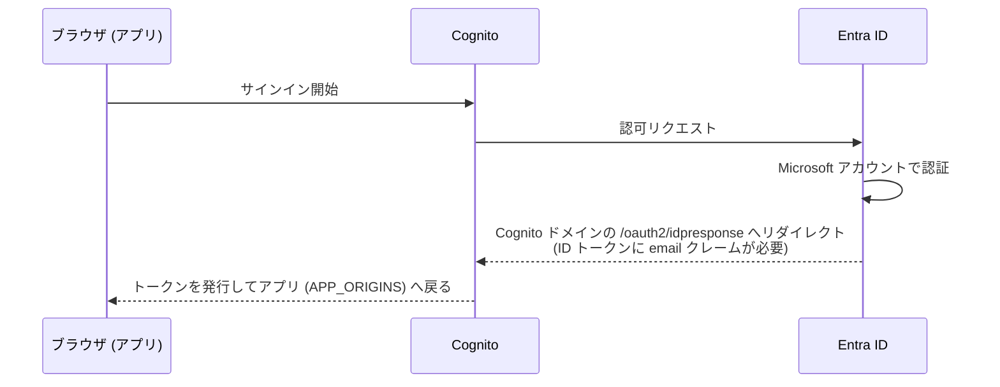

# Microsoft Entra ID SSO の設定

Cognito User Pool の OIDC フェデレーションで Microsoft Entra ID（旧 Azure AD）によるサインインを有効にします。ログイン画面に「Microsoft でサインイン」ボタンが追加され、既存のメール + パスワードログインと共存できます（パスワードログインを無効化する場合は末尾の [SSO 専用モード](#sso-専用モード) を参照）。

サインインの流れは次のとおりです。Entra ID に登録するリダイレクト URI がアプリの URL ではなく **Cognito ドメイン**なのは、アプリと Entra ID の間に Cognito が OIDC プロキシとして挟まるためです。



## 手順

### 1. Entra ID でアプリを登録する

1. [Microsoft Entra 管理センター](https://entra.microsoft.com/)で「アプリの登録」→「新規登録」
   - **サポートされているアカウントの種類**: 「この組織ディレクトリのみに含まれるアカウント」（シングルテナント）
   - リダイレクト URI は Cognito ドメインが確定してから登録するため、この時点では空で構いません
2. 登録後の「概要」ページで以下を控えます
   - **アプリケーション (クライアント) ID** → `ENTRA_CLIENT_ID` に使用
   - **ディレクトリ (テナント) ID** → 環境変数 `ENTRA_TENANT_ID` に使用
3. 「証明書とシークレット」→「新しいクライアントシークレット」を作成し、**値**（シークレット ID ではない方）を控えます

### 2. email クレームを確認する（サインインが失敗する場合のみ）

Cognito はサインイン時に ID トークンの `email` クレームをユーザー属性にマッピングします。テンプレートは Cognito の OIDC 連携で `email` スコープを要求しているため、ユーザーに `mail` 属性が設定されていれば**通常は追加設定なしで email クレームが発行されます**（v2.0 エンドポイントでは email スコープの要求だけで十分です）。

サインインが `attributes required: [email]` エラーで失敗する場合のみ、以下を順に確認してください。

1. ユーザーの `mail` 属性が空でないか（メールボックスなしのアカウント等では発行されません）。空の場合は Entra 側でユーザーの連絡先メールを設定します
2. テナントのポリシーで同意が必要な場合、「API のアクセス許可」の `openid` `email` `profile` に「管理者の同意を与えます」を実行します
3. それでも解決しない場合、アプリの「トークン構成」→「オプションの要求を追加」→ トークンの種類: **ID**、要求: **email** を追加します（email スコープの代替手段）

### 3. シークレットを設定してデプロイする

```bash
npx ampx sandbox secret set ENTRA_CLIENT_ID
# プロンプトにアプリケーション (クライアント) ID を貼り付け
npx ampx sandbox secret set ENTRA_CLIENT_SECRET
# プロンプトにクライアントシークレットの「値」を貼り付け

ENTRA_AUTH=true ENTRA_TENANT_ID=<テナントID> HARNESS_ARN=arn:... npx ampx sandbox --once
```

issuer URL（`https://login.microsoftonline.com/<テナントID>/v2.0`）はテンプレートが組み立てるため、指定するのはテナント ID のみです。

### 4. リダイレクト URI を Entra 側に登録する

デプロイで生成された `amplify_outputs.json` の `auth.oauth.domain` に Cognito ドメイン（例: `xxxxxxxx.auth.us-east-1.amazoncognito.com`）が出力されます。Entra ID のアプリ登録の「認証」→「プラットフォームを追加」→「Web」で以下を登録します。

- **リダイレクト URI**: `https://<Cognito ドメイン>/oauth2/idpresponse`

### 5. 動作確認

`npm run dev` でログイン画面を開き、「Microsoft でサインイン」からサインインできることを確認します。

## SSO 専用モード

`SSO_ONLY=true` を付けてデプロイすると、Cognito のパスワードログインが無効になり、アプリにアクセスすると自動で Entra ID のサインイン画面へリダイレクトされます。

```bash
ENTRA_AUTH=true ENTRA_TENANT_ID=<テナントID> SSO_ONLY=true HARNESS_ARN=arn:... npx ampx sandbox --once
```

## 本番デプロイ（Amplify Hosting）での設定

ここまでの手順は sandbox 前提です。Amplify Hosting の Git 連携で本番環境を作って配布する場合は、環境変数・シークレットを Amplify コンソールで設定します。本番は sandbox とは**別の Cognito User Pool・別の Cognito ドメイン**が作られるため、Entra ID 側へのリダイレクト URI 登録も本番用に追加で必要です。

### 1. 環境変数を設定する

Amplify コンソールでアプリを開き、「ホスティング」→「環境変数」に以下を設定します。

| 環境変数 | 値 |
|---|---|
| `HARNESS_ARN` | Harness の ARN |
| `ENTRA_AUTH` | `true` |
| `ENTRA_TENANT_ID` | ディレクトリ (テナント) ID |
| `APP_ORIGINS` | 本番アプリの URL（初回デプロイ後に設定） |

### 2. シークレットを設定する

「ホスティング」→「シークレット」（Secrets management）に、sandbox のときと同名のキーで設定します。`ampx sandbox secret set` で登録した値はブランチデプロイには引き継がれないため、コンソールでの設定が必須です。

| シークレット | 値 |
|---|---|
| `ENTRA_CLIENT_ID` | アプリケーション (クライアント) ID |
| `ENTRA_CLIENT_SECRET` | クライアントシークレットの「値」 |

設定後、対象ブランチを再デプロイします。

### 3. 本番の Cognito ドメインを Entra 側に登録する

デプロイ完了後、Cognito コンソールで本番用 User Pool（Amplify アプリ名・ブランチ名を含む方）を開き、「ドメイン」から本番の Cognito ドメインを確認します。Entra ID のアプリ登録の「認証」で、sandbox 用とは別にリダイレクト URI を追加します。

- **リダイレクト URI**: `https://<本番 Cognito ドメイン>/oauth2/idpresponse`

アプリ登録は sandbox と同じものを使い回せます（リダイレクト URI を追加するだけで OK）。

### 4. APP_ORIGINS を設定して再デプロイする

発行された本番アプリの URL（例: `https://main.xxxxxxxx.amplifyapp.com`）を環境変数 `APP_ORIGINS` に設定して再デプロイします。これで API の CORS 許可と Cognito のコールバック / ログアウト URL に本番 URL が反映され、Microsoft サインイン後にアプリへ正しく戻れるようになります。

## トラブルシューティング

| 症状 | 原因と対処 |
|---|---|
| サインイン後に `attributes required: [email]` エラー | ID トークンに email クレームがない。[手順 2](#2-email-クレームを確認するサインインが失敗する場合のみ) を確認 |
| `AADSTS50011`（リダイレクト URI 不一致） | Entra 側のリダイレクト URI が `https://<Cognito ドメイン>/oauth2/idpresponse` と完全一致しているか確認 |
| `AADSTS7000215`（invalid client secret） | シークレットの「値」ではなく「シークレット ID」を登録している可能性。値を `ampx sandbox secret set ENTRA_CLIENT_SECRET` で再設定 |
