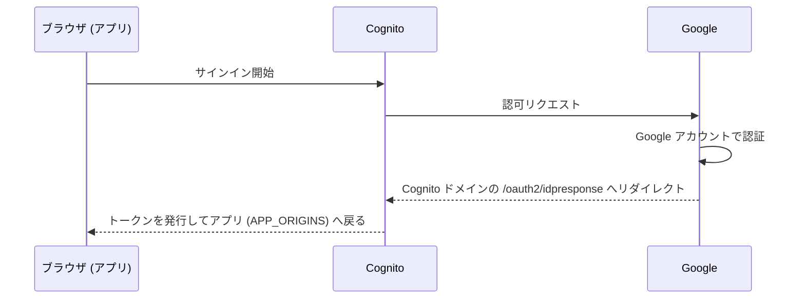

# Google SSO の設定

Cognito User Pool のフェデレーション機能で Google アカウントによるサインインを有効にします。ログイン画面に「Google でサインイン」ボタンが追加され、既存のメール + パスワードログインと共存できます（パスワードログインを無効化する場合は末尾の [SSO 専用モード](#sso-専用モード) を参照）。

サインインの流れは次のとおりです。Google に登録するリダイレクト URI がアプリの URL ではなく **Cognito ドメイン**なのは、アプリと Google の間に Cognito が OIDC プロキシとして挟まるためです。



## 手順

### 1. Google Cloud で OAuth クライアントを作成する

1. [Google Cloud コンソール](https://console.cloud.google.com/)で対象プロジェクトを開きます
2. 「API とサービス」→「OAuth 同意画面」を設定します
   - Google Workspace 組織内のみで使う場合は **User Type: 内部** を推奨（外部の場合はテストユーザー登録または公開審査が必要）
3. 「認証情報」→「認証情報を作成」→「OAuth クライアント ID」→ アプリケーションの種類は **ウェブアプリケーション**
   - リダイレクト URI は Cognito ドメインが確定してから登録するため、この時点では空で構いません
4. 発行された **クライアント ID** と **クライアントシークレット** を控えます

### 2. シークレットを設定してデプロイする

クライアント ID / シークレットは環境変数ではなく Amplify の secret として保存します。

```bash
npx ampx sandbox secret set GOOGLE_CLIENT_ID
# プロンプトにクライアント ID を貼り付け
npx ampx sandbox secret set GOOGLE_CLIENT_SECRET
# プロンプトにクライアントシークレットを貼り付け

GOOGLE_AUTH=true HARNESS_ARN=arn:... npx ampx sandbox --once
```

### 3. リダイレクト URI を Google 側に登録する

デプロイで生成された `amplify_outputs.json` の `auth.oauth.domain` に Cognito ドメイン（例: `xxxxxxxx.auth.us-east-1.amazoncognito.com`）が出力されます。Google Cloud の OAuth クライアント設定に戻り、以下を登録します。

- **承認済みの JavaScript 生成元**: `https://<Cognito ドメイン>`
- **承認済みのリダイレクト URI**: `https://<Cognito ドメイン>/oauth2/idpresponse`

### 4. 動作確認

`npm run dev` でログイン画面を開き、「Google でサインイン」からサインインできることを確認します。サインインしたユーザーは User Pool に外部プロバイダー連携ユーザーとして作成されます。

## サインインできるアカウントを制限する（推奨）

Cognito のフェデレーションは初回サインイン時にユーザーを自動作成するため、既定では**任意の Google アカウント**でサインインできます。組織内に限定するには、メールドメイン制限を併せて設定してください。

```bash
ALLOWED_EMAIL_DOMAINS=example.com GOOGLE_AUTH=true HARNESS_ARN=arn:... npx ampx sandbox --once
```

この制限は SSO の初回サインイン（ユーザー自動作成）にも適用され、許可ドメイン以外のアカウントはサインインに失敗します。なお、制限を追加する前に作成済みのユーザーは削除されないため、必要に応じて Cognito コンソールから手動で削除してください。

## SSO 専用モード

`SSO_ONLY=true` を付けてデプロイすると、Cognito のパスワードログインが無効になり、アプリにアクセスすると自動で Google のサインイン画面へリダイレクトされます。

```bash
GOOGLE_AUTH=true SSO_ONLY=true HARNESS_ARN=arn:... npx ampx sandbox --once
```

## 本番デプロイ（Amplify Hosting）での設定

ここまでの手順は sandbox 前提です。Amplify Hosting の Git 連携で本番環境を作って配布する場合は、環境変数・シークレットを Amplify コンソールで設定します。本番は sandbox とは**別の Cognito User Pool・別の Cognito ドメイン**が作られるため、Google 側へのリダイレクト URI 登録も本番用に追加で必要です。

### 1. 環境変数を設定する

Amplify コンソールでアプリを開き、「ホスティング」→「環境変数」に以下を設定します。

| 環境変数 | 値 |
|---|---|
| `HARNESS_ARN` | Harness の ARN |
| `GOOGLE_AUTH` | `true` |
| `APP_ORIGINS` | 本番アプリの URL（初回デプロイ後に設定） |

### 2. シークレットを設定する

「ホスティング」→「シークレット」（Secrets management）に、sandbox のときと同名のキーで設定します。`ampx sandbox secret set` で登録した値はブランチデプロイには引き継がれないため、コンソールでの設定が必須です。

| シークレット | 値 |
|---|---|
| `GOOGLE_CLIENT_ID` | OAuth クライアント ID |
| `GOOGLE_CLIENT_SECRET` | OAuth クライアントシークレット |

設定後、対象ブランチを再デプロイします。

### 3. 本番の Cognito ドメインを Google 側に登録する

デプロイ完了後、Cognito コンソールで本番用 User Pool（Amplify アプリ名・ブランチ名を含む方）を開き、「ドメイン」から本番の Cognito ドメインを確認します。Google Cloud の OAuth クライアント設定に、sandbox 用とは別にもう 1 組追加します。

- **承認済みの JavaScript 生成元**: `https://<本番 Cognito ドメイン>`
- **承認済みのリダイレクト URI**: `https://<本番 Cognito ドメイン>/oauth2/idpresponse`

### 4. APP_ORIGINS を設定して再デプロイする

発行された本番アプリの URL（例: `https://main.xxxxxxxx.amplifyapp.com`）を環境変数 `APP_ORIGINS` に設定して再デプロイします。これで API の CORS 許可と Cognito のコールバック / ログアウト URL に本番 URL が反映され、Google サインイン後にアプリへ正しく戻れるようになります。
