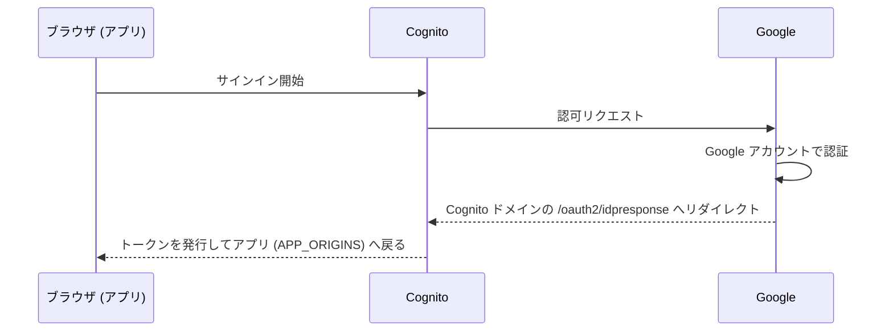

# Google SSO の設定

Cognito User Pool のフェデレーション機能で Google アカウントによるサインインを有効にします。ログイン画面に「Google でサインイン」ボタンが追加され、既存のメール + パスワードログインと共存できます（パスワードログインを無効化する場合は末尾の [SSO 専用モード](#sso-専用モード) を参照）。

サインインの流れは次のとおりです。Google に登録するリダイレクト URI がアプリの URL ではなく **Cognito ドメイン**なのは、アプリと Google の間に Cognito が OIDC プロキシとして挟まるためです。



## 手順

### 1. Google Cloud で OAuth クライアントを作成する

1. [Google Cloud コンソール](https://console.cloud.google.com/)で対象プロジェクトを開きます
2. 「API とサービス」→「OAuth 同意画面」を設定します
   - Google Workspace 組織内のみで使う場合は **User Type: 内部** を推奨（外部の場合はテストユーザー登録または公開審査が必要）
3. 「認証情報」→「認証情報を作成」→「OAuth クライアント ID」→ アプリケーションの種類は **ウェブアプリケーション**
   - リダイレクト URI は Cognito ドメインが確定してから登録するため、この時点では空で構いません
4. 発行された **クライアント ID** と **クライアントシークレット** を控えます

### 2. シークレットを設定してデプロイする

クライアント ID / シークレットは環境変数ではなく Amplify の secret として保存します。

```bash
npx ampx sandbox secret set GOOGLE_CLIENT_ID
# プロンプトにクライアント ID を貼り付け
npx ampx sandbox secret set GOOGLE_CLIENT_SECRET
# プロンプトにクライアントシークレットを貼り付け

GOOGLE_AUTH=true HARNESS_ARN=arn:... npx ampx sandbox --once
```

### 3. リダイレクト URI を Google 側に登録する

デプロイで生成された `amplify_outputs.json` の `auth.oauth.domain` に Cognito ドメイン（例: `xxxxxxxx.auth.us-east-1.amazoncognito.com`）が出力されます。Google Cloud の OAuth クライアント設定に戻り、以下を登録します。

- **承認済みの JavaScript 生成元**: `https://<Cognito ドメイン>`
- **承認済みのリダイレクト URI**: `https://<Cognito ドメイン>/oauth2/idpresponse`

### 4. 動作確認

`npm run dev` でログイン画面を開き、「Google でサインイン」からサインインできることを確認します。サインインしたユーザーは User Pool に外部プロバイダー連携ユーザーとして作成されます。

## SSO 専用モード

`SSO_ONLY=true` を付けてデプロイすると、Cognito のパスワードログインが無効になり、アプリにアクセスすると自動で Google のサインイン画面へリダイレクトされます。

```bash
GOOGLE_AUTH=true SSO_ONLY=true HARNESS_ARN=arn:... npx ampx sandbox --once
```

## 本番デプロイ時の注意

- Amplify Hosting でのブランチデプロイでは、シークレットは Amplify コンソールの「Secrets」（Hosting → Secrets management）に同名キーで設定します
- 本番 URL を `APP_ORIGINS` に追加すると、Cognito のコールバック URL にも自動反映されます
